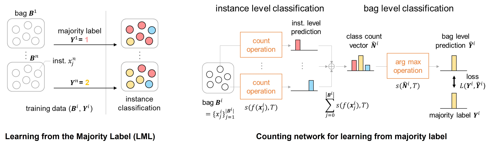

# Counting-Network-for-Learning-from-Majority-Label



Shikui Kaito, Shinnosuke Matsuo, Daiki Suehiro, Ryoma Bise
> The paper proposes a novel problem in multi-class Multiple-Instance
Learning (MIL) called Learning from the Majority Label (LML).
In LML, the majority class of instances in a bag is assigned as the
bag’s label. LML aims to classify instances using bag-level majority
classes. This problem is valuable in various applications. Exist
ing MIL methods are unsuitable for LML due to aggregating confi
dences, which may lead to inconsistency between the bag-level label
and the label obtained by counting the number of instances for each
class. This may lead to incorrect instance-level classification. We
propose a counting network trained to produce the bag-level majority
labels estimated by counting the number of instances for each class.
This led to the consistency of the majority class between the net
work outputs and one obtained by counting the number of instances.
Experimental results show that our counting network outperforms
conventional MIL methods on four datasets. Ablation studies fur
ther confirm the counting network superiority.

# Requirement
To set up their environment, please run:  
(we recommend to use [Anaconda](https://www.anaconda.com/) for installation.)
```
conda env create -n LML -f LML.yml
conda activate LML
```

# Dataset
ou can create dataset by running following code. Dataset will be saved in ./data directory.
```
python ./make_bag/crossvali_make_dataset_10class_uniform.py
```

# Training & Test
After creating your python environment and Dataset which can be made by following above command, you can run Counting-Network code.
If you want to train the network, please run following command. 5 fold cross-validation trainning is implemented.
```
python ./main.py --module 'Count' --dataset='cifar10' --classes=10 --majority_size "various" --output_path './result/' --is_evaluation 0
```
If you want to evaluation the network, please run following command. 5 fold cross-validation test is implemented.
```
python ./main.py --module 'Count' --dataset='cifar10' --classes=10 --majority_size "various" --output_path './result/' --is_evaluation 1
```
# Citation
If you find this repository helpful, please consider citing:
```
Inproceeedings
```

# Author
@ Shiku Kaito  
・ Contact: kaito.shiku@human.ait.kyushu-u.ac.jp
